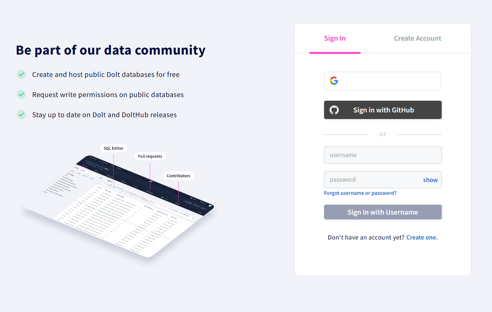
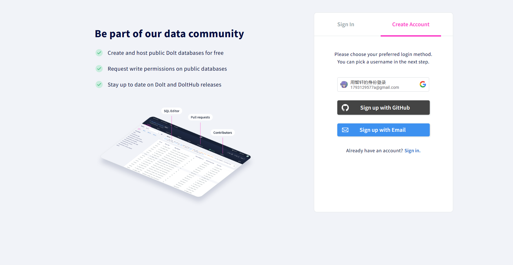
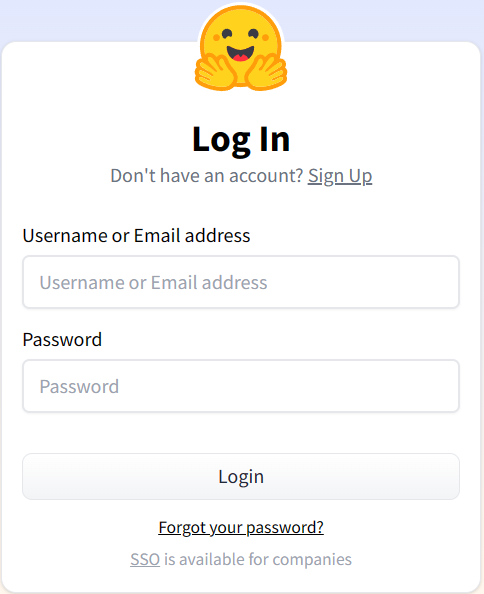
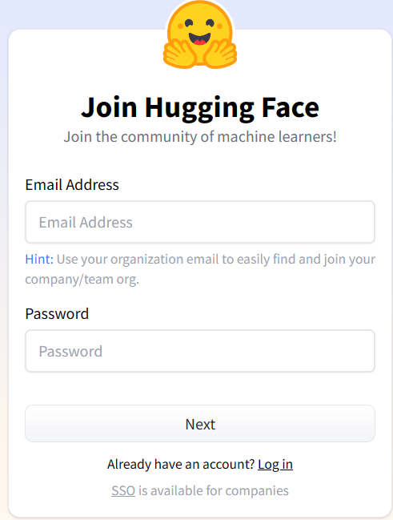

> 以下样式仅用作表单样式初期参考，具体功能根据实际情况修改 

## dolthub登录界面&登录表单&注册表单
> dolthub采用左侧介绍功能，右侧功能表单模式 
<u><strong>dolthub登陆表单：</strong></u>
 
<u><strong>dolthub注册表单：</strong></u>

## huggingface登录界面&登录表单&注册表单
> huggingface功能表单为竖向的矩形且页面中只有一个居中的功能表单，与github样式相似 
<u><strong>huggingface登陆表单：</strong></u>
 
<u><strong>huggingface注册表单：</strong></u>

## gitee登录界面&登录表单&注册表单
> gitee的登录界面采用背景一张大图，由两个竖向矩形组成，一个用于介绍，一个用于实现功能，国内比较熟悉这种结构 
<u><strong>gitee登陆表单：</strong></u>
 
<u><strong>gitee注册表单：</strong></u>

## and more...（可以提供给我更好的参考或对已有参考提出意见）